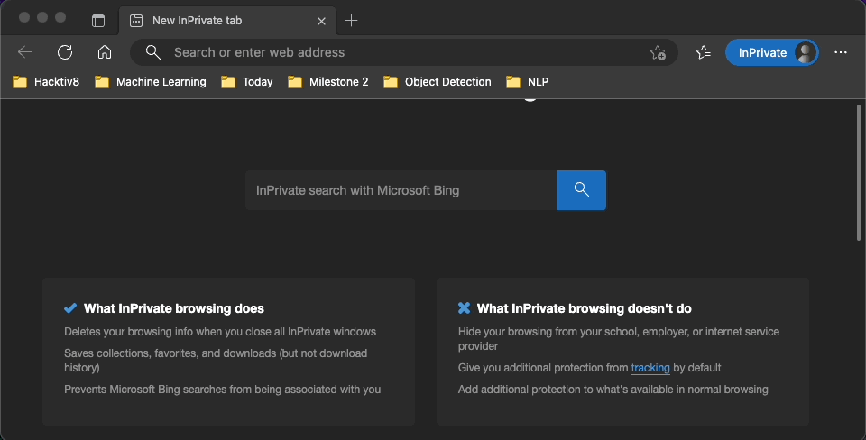

  

# SoMAs (Stock Market Analysis)

There is a saying 
> Understanding people is rule number one in investing.

[SoMAs](https://semas.godata.id) exists to help you understand the public perception of a stock by reading public commentary and interpreting the sentiment of every comments for you.

## Challenging Task

We take a look at Stockbit.com's attempt to do [news based sentiment analysis](https://stockbit.com/#/symbol/GOTO). We wanted to challenge ourselves to do a sentiment analysis based on the comments from Stockbit.com.

This is a challenging task because Stockbit.com allows users to tag stock symbols to repost user comments. For example, a user commented `ICBP ayo naik. $ICBP $INDF` in the comments section of ICBP. `$ICBP $INDF` will repost user comments in the ICBP and INDF comments section.

Another challenge is that any user can post on Stockbit.com. This results in poorly written comments such as informal language, typos and spam comments.

Other notable challenges:
1. Define not spam, spam, neutral, negative, positive as specifically as possible. So our team can understand and label comments properly. Also, label definitions must be acceptable to [SoMAs](https://semas.godata.id) users.
2. Different Stocks, Different People's problem. Everyone expressed their sentiments differently.

Contact us for the solution.

## Technology Stacks

Under the hood we use Selenium, Scikit-Learn, NLTK, Regular Expression, Pandas, Numpy, Flask, React, NGINX and Docker. We deployed [SoMAS](https://semas.godata.id) to Alibaba Cloud.

## Demo Program

## Team

- Ardiansyah Arya Salvinia  
- Febrian Hendifa  
- Husain Tsabit Abdur Rahim  
- Jason Rich Darmawan  
- Rafif Dwiputra  
- Ucik Refani Kurnia  